.. _SCEEWV:

======
SCEEWV
======

*sceewv* is a tool to check, evaluate and analyze the performance of the 
Early Warning System. It reads information from the SeisComP system, 
store critical parameters in JSON databases, and creates dashboards that 
allow checking the performance interactively

SeisComp Module
---------------

*sceewv* reads event information including preferred and non-preferred 
origins to create databases with the required information to check the early 
warning performance.
*sceewv* also stores acceleration envelope values 
using the *sceewenv* module, store this information in a database and 
use it to produce products that allow a fast evaluation of the seismic 
data for specific earthquakes.

This module can be used in two ways:

* Real-time: *sceewv* connects directly with the messaging system and listens for new/updated/removed objects related to  early warning processing. 

* Command-line: *sceewv* queries the SeisComP database for a specific period looking for all required information to update the dashboard. 

To read and compute events information:

.. code-block:: sh

 $sceewv -u usr --query --start "%Y-%m-%d %H:%M:%S" --end "%Y-%m-%d 
 %H:%M:%S" --debug

To compute envelope information:

.. code-block:: sh

 $sceewv -u usr --envelope --envstart "%Y-%m-%d %H:%M:%S" --endstart 
 "%Y-%m-%d %H:%M:%S" --debugcode

JSON Databases
--------------

All data is stored in two JSON databases stored by default in the 
default DATADIR of SeisComP.

The first database includes all information related to Events, Origins, 
Picks and Magnitudes and is organized following the next structure:

.. code-block:: sh

 @DATADIR/events/year/month/day/eventID

The second database includes acceleration envelope information for each 
station sorted by distance to the epicenter. This database is organized 
following the next structure:

.. code-block:: sh

 DATADIR@/event/year/month/day/eventID

Files are stored in *JSON* format.

Events Dashboard
----------------

.. _fig-eventDash1:

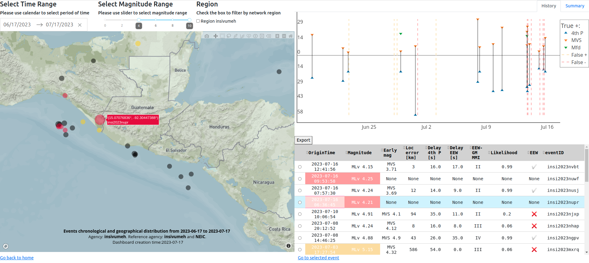

This dashboard includes the information stored in the events database 
and allows control quality of early warning results for a particular 
selection of events.

.. _fig-eventDash2:

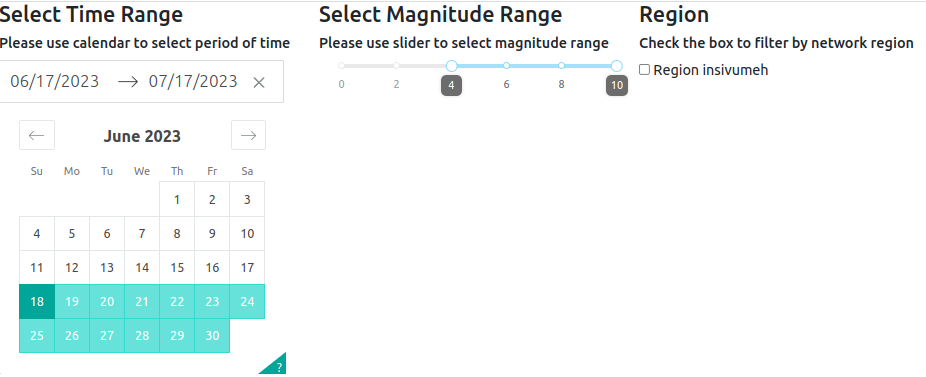

To use this application, you must select the events to analyze. To 
select events, you must:
* Use drop-down menus at the top of the map on the left side to choose the period
* Use the slider at the top of the map in the middle to choose the magnitude range.
* Restrict the area to your interest region (configurable) using the check box at the top of the map on the right side.

.. _fig-eventDash3:

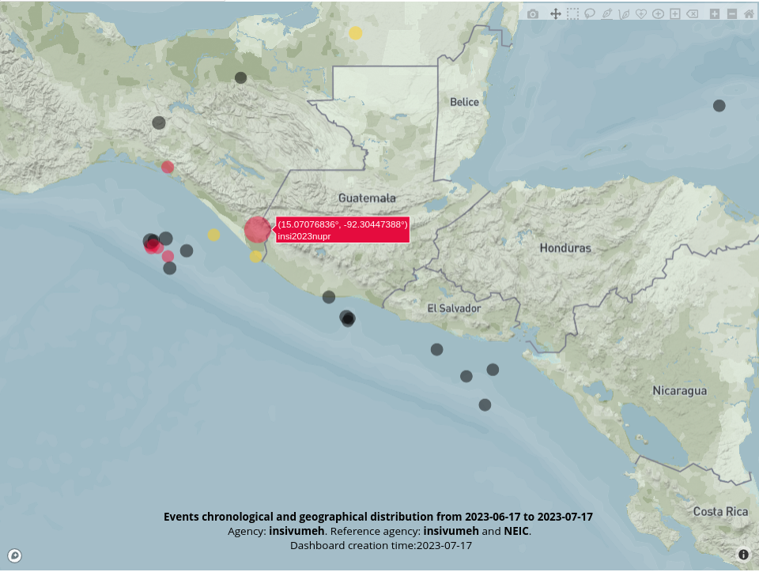

The map on the left side shows the selected events. The map shows 
events as circles. The event selected in the table is displayed with 
the biggest circle, and you can select an event if you click an event 
on the map. Circles could have three colors: black for true positives, 
yellow for false positives, and green for false negatives. At the 
bottom of the map, some relevant information is displayed. The map is 
interactive. It allows you to change the zoom (using the scroll) and to 
move the area (holding the left click). More interaction options could 
be activated using the menu in the upper right corner. Hovering the 
pointer over each circle on the map displays information (configurable) 
related to the event.

.. _fig-eventDash4:

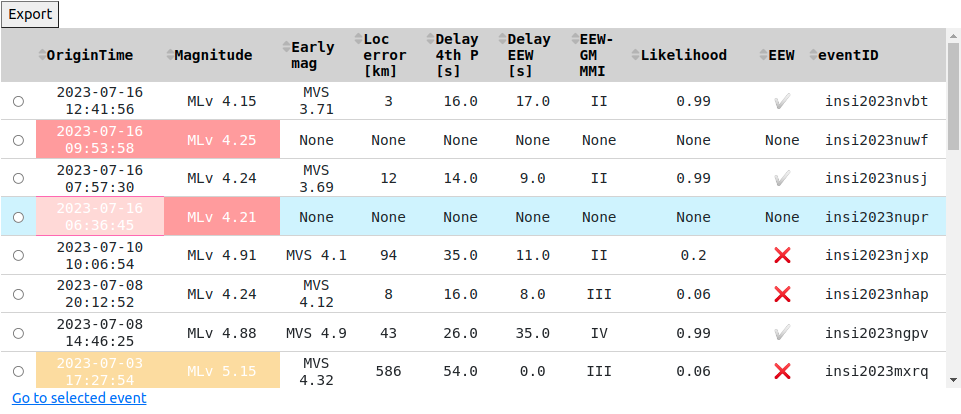

The table with selected events is shown in the lower part of the right 
side of the events dashboard. The first two columns display information 
for the preferred origin. These columns could have a background color; 
yellow in case of a false positive, red in case of a false negative, or 
white for true positive events. Information regarding early warning 
solutions is shown from the third to the eighth column. The ninth 
column, called "EEW" indicates whether or not this information was sent 
to the early warning dissemination system such as EEWD, EEWBS, or the 
mobile application. The event selected in the table will be shown with 
a blue background and highlighted on the map (the biggest circle). 
Information can be sorted in descending order or ascending using the 
values of any column. The selection circle on the left side of each 
event allows you to select a single event to be analyzed with the event 
dashboard by pressing the link ”Go to selected event".

.. _fig-eventDash5:

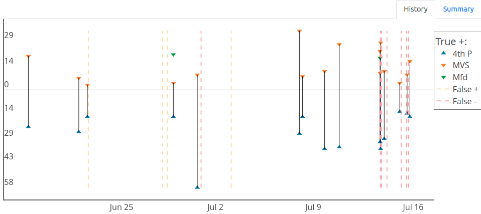

In the upper part of the right side, you can select History to show the 
graph of delays for selected events. This plot shows in colored 
triangles the delay value corresponding to the arrival of the first 4 
phases (4th P) and the computation times for the previously configured 
types of magnitudes. A black line connects the delays of one event. The 
The 4th P delay is plotted below the zero line, but these are positive 
values. The yellow and red dotted lines show the false positives and 
false negatives. This graph is interactive. It allows you to modify the 
zoom (by selecting an area with the left click). Interaction options 
could be activated by hovering over the upper right corner. Data series 
can be deactivated or activated by pressing the name in the legend.

.. _fig-eventDash6:

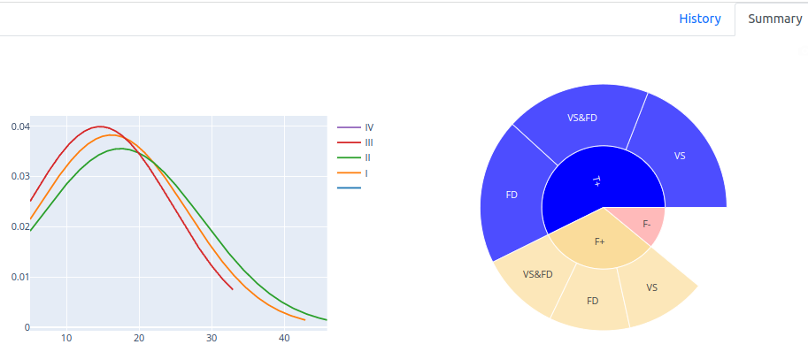

At the top of the right side, you can select summary to display two 
graphs. On the left, is the histogram of delays in seconds for each 
intensity value. Intensities can be activated or deactivated by 
clicking on the legend. On the right, the plot shows the number of 
events T+, F+, and F- of the selected events. Clicking on the 
categories T+ and F+ modifies the graph showing the number of events 
with FinDer, VS, or FinDer and VS for the selected category. Hovering 
the pointer over any classification will show the corresponding number 
of events.

Event Dashboard
---------------

This dashboard includes the information stored in the event database 
and allows control quality of early warning results for a particular 
event:

.. _fig-eventsDash:

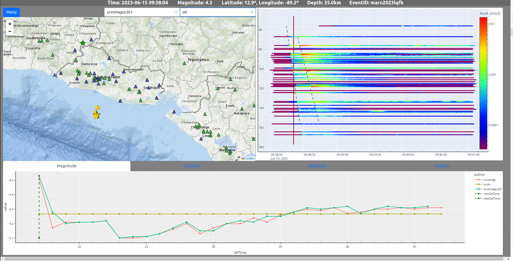

Events and event dashboards are all linked. To open the event dashboard from 
the events dashboard uses the white circle on the left of the table and 
pass the link at the bottom of the table called "Go to selected 
event":

.. _fig-eventsDash:

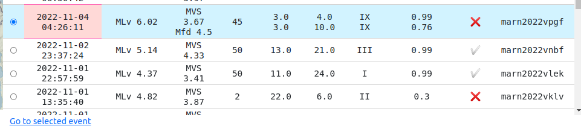

Dropdown menus to select EEW solutions and stations:

* Dropdown menu on the left with early warning solutions for the selected event. It is possible to select any solution that will modify the map, envelope plot, and performance plots content according to the selected solution.
* Dropdown menu on the right with two options, "all" and "used," means select all available stations or stations used by the chosen solution in the side dropdown menu. The map and envelope plot content will change according to the selected option.

Using the data stored in the events and event JSON databases, the 
 dashboard displays a map with all the early warning solutions:

.. _fig-eventsDash:

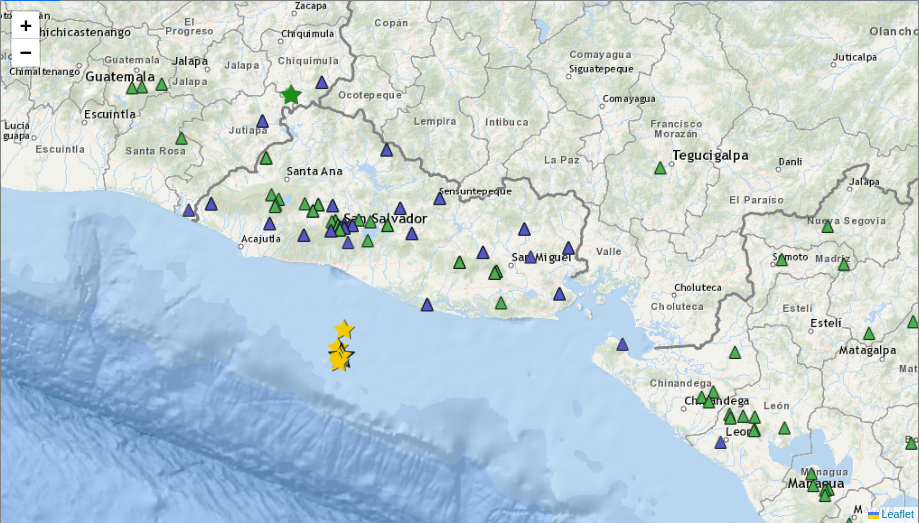

Below is a description for each object on the map:

* The stars represent the different locations. The black star is the preferred origin location, the yellow ones are all the locations associated with early warning solutions, and the green star symbolizes the EEW solution selected in the left dropdown menu at the top of the map.
* The green circles with dashed lines show fixed values of delay between the time of computing the selected early warning solution and the time the S phase takes to arrive.
* The green circles with solid lines represent intensity values reached for the selected early warning solution.
* The black circles with dashed lines represent some fixed values of delay between the computing time of the preferred solution and the time the S phase takes to arrive.
* The solid black circles represent intensity values achieved for the selected preferred solution.
* The purple triangles show the location of the stations with accelerometers.
* The green triangles show the location of stations with equipment other than accelerometers.

Envelopes of acceleration are shown in a graph of distance versus time:

.. _fig-eventsDash:

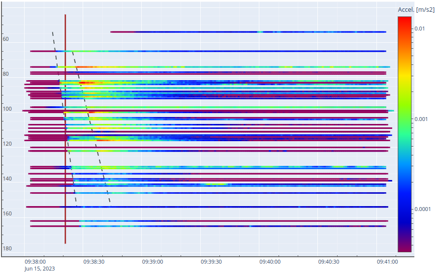

This graph shows a line for each station. On the Y axis the epicentral 
distances of the stations, and on the X axis, the UTC time. In colors, 
the acceleration values are presented in m/s2. The red vertical line 
shows the time of the selected early warning solution. In addition, the 
arrivals of the direct and refracted P and S waves are shown in gray 
dotted lines.

The main objectives of this graph are:

* Compare the time of the EEW solution with the theoretical and real arrival of the P and S waves.
* To check the value of the accelerations measured at each station and the variation of acceleration for the same station according to the different arrivals of seismic waves.
* Distribution regarding the hypocentral distance of the stations selected in the dropdown at the top of the map.
* See other effects, such as energy attenuation increasing the hypocentral distance.

Using the parametric data stored in the events database, the dashboard 
shows several graphs to monitor some important parameters computed 
during the process of locating and estimating the magnitudes by the 
early warning system:

.. _fig-eventsDash:

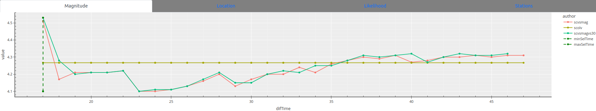

The dashboard has four quality control diagrams:

* Magnitude: Shows the values of each type of early warning magnitude. It also displays the preferred magnitude value as a reference value.
* Location: Shows the differences in km of the locations associated with EEW magnitudes versus preferred location.
* Likelihood: Shows the likelihood values for each type of early warning magnitude.
* Stations: The number of stations used to compute locations associated with early warning magnitude types. It also presents the number of stations used for the preferred location as a reference value.

The green vertical lines in all diagrams indicate the values related to 
the EEW selected solution in the dropdown on the top of the map.

.. _fig-eventsDash:

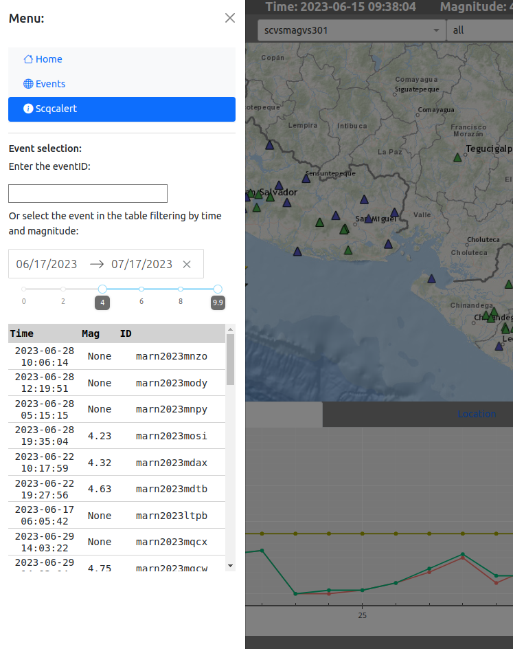

In the top right corner, the button labeled menu unfolds a hidden side 
menu with links to the index and other dashboards. Below are options to 
select the event using the eventID or look for the event using the time 
and magnitude range.
